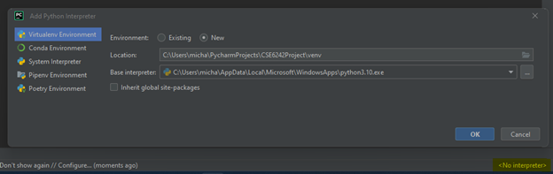
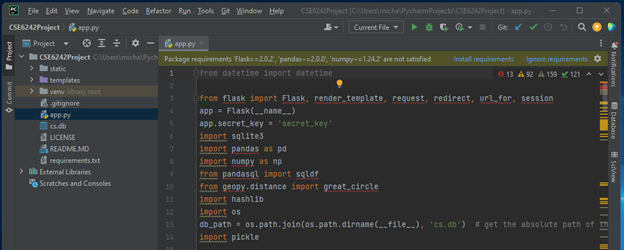
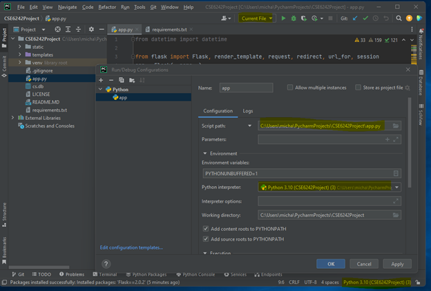
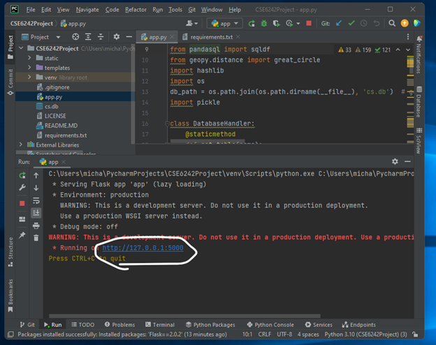

<!-- PROJECT LOGO -->
<br />
<div align="center">
  <a href="https://github.com/MaikKalil/CSE6242Project/blob/main/static/images/CollegeSelectionLogoGold.svg">
    
  </a>

  <h1 align="center">College Selection Made Easy</h1>

  <p align="center">
    A better way to search and compare colleges!
    <br />
    <a href="https://github.com/MaikKalil/CSE6242Project/issues">Report Bug</a>
    ·
    <a href="https://github.com/MaikKalil/CSE6242Project/issues">Request Feature</a>
  </p>
</div>


<!-- TABLE OF CONTENTS -->
<details>
  <summary>Table of Contents</summary>
  <ol>
    <li>
      <a href="#about-the-project">About The Project</a>
      <ul>
        <li><a href="#built-with">Built With</a></li>
      </ul>
    </li>
    <li>
      <a href="#getting-started">Getting Started</a>
      <ul>
        <li><a href="#prerequisites">Prerequisites</a></li>
        <li><a href="#installation">Installation</a></li>
        <li><a href="#running">Running</a></li>
      </ul>
    </li>
    <li><a href="#usage">Usage</a></li>
    <li><a href="#roadmap">Roadmap</a></li>
    <li><a href="#contributing">Contributing</a></li>
    <li><a href="#license">License</a></li>
    <li><a href="#contact">Contact</a></li>
    <li><a href="#acknowledgments">Acknowledgments</a></li>
  </ol>
</details>


<!-- ABOUT THE PROJECT -->
## About The Project

For many high school students, one of the first major decisions they must make is choosing where to 
attend college. Many low-income and minority students lack the resources necessary to make informed 
decisions about college, resulting in limited access to higher education. To address this problem, 
our objective is to create an interactive dashboard that allows prospective college students to compare 
and discover colleges based on their profile and preferences. If we can equip students with knowledge of the 
differences in institution types, admission requirements, cost estimates, and other institutional factors, we 
can help students choose schools that fit their needs, which increases the likelihood that they attend college. 
Ultimately, our goal is to provide equitable access to college decision-making resources and increase opportunities 
for underrepresented students in higher education by providing an interactive tool to help visualize, search, and rank 
schools in the College Scorecard dataset. 

<p align="right">(<a href="#readme-top">back to top</a>)</p>


### Built With

Below are a few of the many technologies and libraries our team referenced to construct our web application:  

* [![SQLite][SQLite]][SQLite-url]
* [![JQuery][JQuery.com]][JQuery-url]
* [![Flask][Flask]][Flask-url]
* [![d3][d3]][d3-url]
* [![Python][Python]][Python-url]
* [![Jupyter][Jupyter]][Jupyter-url]
* [![Pycharm][Pycharm]][Pycharm-url]
* [![MS][MS]][MS-url]
* [![Git][Git]][Git-url]

<p align="right">(<a href="#readme-top">back to top</a>)</p>


<!-- GETTING STARTED -->
## Getting Started

The web app can be run locally using Python. Download Pycharm for an easy-to-use IDE that can have you up and running in no time with the following simple steps. 

### Prerequisites

* [Pycharm Pro](https://www.jetbrains.com/pycharm/download/#section=windows) (open source community version will work too) 
  - The latest version of Python is bundled with installation.

### Installation

1. [Clone repository | PyCharm Documentation (jetbrains.com)](https://www.jetbrains.com/help/pycharm/cloning-repository.html)
   ```sh
   git clone https://github.com/MaikKalil/CSE6242Project.git
   ```
2. Create an environment for the project
   
   Bottom right select `No interpreter` > `Add New Interpreter` > `Add Local Interpreter`
   
    
    
   Notice you will now see a `venv` folder underneath the `templates` folder in the Project view in the top left corner of your window.
   
  
3. Install package requirements `requirements.txt`
   
   Open the app.py file by double-clicking on file in Project view
   
   
   
   You should see warnings to install 13 package dependencies. Select `Install requirements` to install the modules listed in the requirements file along with their dependencies. 
   
4. Edit run configuration
   
   Top right select `Current File` > `Edit Configurations` > `Add New Run Configuration` > Select `Python`
   
    
    
   In the script path navigate to the `app.py` file in the project folder. Make sure the Python interpreter matches the interpreter selected at the bottom of the screen before selecting `OK`.
   
### Running

Select the play button to execute `app.py`. Python will create a local web server with a link in the Run screen to the login page of the web application.



<p align="right">(<a href="#readme-top">back to top</a>)</p>


<!-- USAGE EXAMPLES -->
## Usage

Please refer to the [Usage documentation](https://github.com/MaikKalil/CSE6242Project/blob/main/Usage.pdf) for explanations on how to use the tool and how the results are derived. 

<p align="right">(<a href="#readme-top">back to top</a>)</p>


<!-- ROADMAP -->
## Roadmap

The roadmap is intended to highlight opportunities for future development

- [x] Build local web app that ranks schools based on user preferences.
- [ ] Add additional inputs for test scores to allow user to specify how these scores are normalized in RankHandler. \
      (e.g. Currently the 25th percentile is used but perhaps the user would prefer the 75th percentile to see schools with higher test scores.)   
- [ ] Modify calc_dist() function in RankHandler to use driving distance from an api like Google Maps instead of geodesic distance from geopy. 
- [ ] Add functionality for users to include specific schools in their search results (a current feature in the College Scorecard).
- [ ] Add user password protection and stricter validation of email addresses.
- [ ] Fix the landing page header to remain frozen at the top of the webpage when user scrolls.
- [ ] Add functionality for users to include specific schools in their search results (a current feature in the College Scorecard).
- [ ] Add additional preferences for sports and/or college rankings. \
      (NCAA and U.S. News World College rankings would require permission.)
- [ ] Deploy web app to cloud service such MS Azure to expand access to a wider audience. \
      (Production deployment will require modification of code to handle concurrent users.)

See the [open issues](https://github.com/MaikKalil/CSE6242Project/issues) for a full list of proposed features (and known issues).

<p align="right">(<a href="#readme-top">back to top</a>)</p>


<!-- CONTRIBUTING -->
## Contributing

Contributions are what make the open source community such an amazing place to learn, inspire, and create. Any contributions you make are **greatly appreciated**.

If you have a suggestion that would make this better, please fork the repo and create a pull request. You can also simply open an issue with the tag "enhancement".
Don't forget to give the project a star! Thanks again!

1. Fork the Project
2. Create your Feature Branch (`git checkout -b feature/AmazingFeature`)
3. Commit your Changes (`git commit -m 'Add some AmazingFeature'`)
4. Push to the Branch (`git push origin feature/AmazingFeature`)
5. Open a Pull Request

<p align="right">(<a href="#readme-top">back to top</a>)</p>


<!-- LICENSE -->
## License

Distributed under the MIT License. See `LICENSE.txt` for more information.

<p align="right">(<a href="#readme-top">back to top</a>)</p>


<!-- CONTACT -->
## Contact

Michael Jones - [Linkedin](linkedin.com/in/mikekaliljones) - mkjones@gatech.edu \
William Loveless - [Linkedin](linkedin.com/in/williamloveless1) - hloveless3@gatech.edu \
Mallory Herrmann - [Linkedin](linkedin.com/in/mallory-herrmann-412379171) - mherrmann@gatech.edu \
Steffan Seok - [Linkedin](linkedin.com/in/steffan-seok) - sseok3@gatech.edu \
Zubaid Mushfiq - [Linkedin](linkedin.com/in/zubaid-mushfiq-a09647122) - zmushfiq3@gatech.edu \
Ankur Falor - [Linkedin](linkedin.com/in/ankurfalor) - afalor3@gatech.edu


<p align="right">(<a href="#readme-top">back to top</a>)</p>


<!-- ACKNOWLEDGMENTS -->
## Acknowledgments

Special thanks to the United States Department of Education for providing a comprehensive data set on colleges.  

* [USDE College Scorecard](https://collegescorecard.ed.gov/)
* [Technical Documentation: College Scorecard Institution-Level Data](https://collegescorecard.ed.gov/assets/InstitutionDataDocumentation.pdf)
* [Technical Documentation: College Scorecard Data by Field of Study](https://collegescorecard.ed.gov/assets/FieldOfStudyDataDocumentation.pdf)
* [Zip Code Lat Lon: https://simplemaps.com/data/us-zips](https://simplemaps.com/data/us-zips)
* [MS Azure Flask Webapp Quickstart Guide](https://github.com/Azure-Samples/msdocs-python-flask-webapp-quickstart)
* [Readme Template](https://github.com/othneildrew/Best-README-Template)
* [Markdown Badges 1](https://github.com/Ileriayo/markdown-badges)
* [Markdown Badges 2](https://github.com/alexandresanlim/Badges4-README.md-Profile)

<p align="right">(<a href="#readme-top">back to top</a>)</p>


<!-- MARKDOWN LINKS & IMAGES -->
<!-- https://www.markdownguide.org/basic-syntax/#reference-style-links -->

[SQLite]: https://img.shields.io/badge/sqlite-%2307405e.svg?style=for-the-badge&logo=sqlite&logoColor=white
[SQLite-url]: https://www.sqlite.org/
[Flask]: https://img.shields.io/badge/flask-%23000.svg?style=for-the-badge&logo=flask&logoColor=white
[Flask-url]: https://flask.palletsprojects.com/
[Jupyter]: https://img.shields.io/badge/jupyter-%23FA0F00.svg?style=for-the-badge&logo=jupyter&logoColor=white
[Jupyter-url]: https://jupyter.org/
[Pycharm]: https://img.shields.io/badge/pycharm-143?style=for-the-badge&logo=pycharm&logoColor=black&color=black&labelColor=green
[Pycharm-url]: https://www.jetbrains.com/pycharm/
[Python]: https://img.shields.io/badge/python-3670A0?style=for-the-badge&logo=python&logoColor=ffdd54
[Python-url]: https://www.python.org/
[d3]: https://img.shields.io/badge/d3.js-F9A03C?style=for-the-badge&logo=d3.js&logoColor=white
[d3-url]: https://d3js.org/
[MS]: https://img.shields.io/badge/Microsoft_Teams-6264A7?style=for-the-badge&logo=microsoft-teams&logoColor=white
[MS-url]: https://www.microsoft.com/en-us/microsoft-teams/group-chat-software
[JQuery.com]: https://img.shields.io/badge/jQuery-0769AD?style=for-the-badge&logo=jquery&logoColor=white
[JQuery-url]: https://jquery.com 
[Git]: https://img.shields.io/badge/github-%23121011.svg?style=for-the-badge&logo=github&logoColor=white
[Git-url]: https://github.com/
